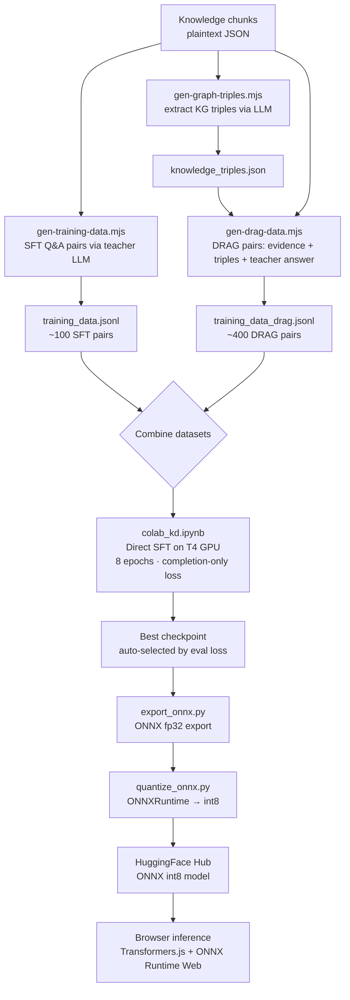

# SmolLM2-360M — DRAG Fine-Tuning Pipeline

> A reproducible pipeline for fine-tuning a 360M-parameter language model on
> structured knowledge using **DRAG** (Distilled Retrieval-Augmented Generation).
>
> The resulting model runs entirely **in the browser** via
> [Transformers.js](https://huggingface.co/docs/transformers.js) — no server required.

---

## What is DRAG?

**DRAG** (Distilled Retrieval-Augmented Generation) trains a small model to answer
questions grounded in retrieved evidence — not from memorized facts.

Standard SFT trains on simple question → answer pairs. The model memorizes answers
and hallucinates when asked anything outside its training set.

DRAG fixes this by:

1. Using a **large teacher model** (Llama 3.3 70B via Groq) to generate high-quality,
   grounded answers from retrieved evidence chunks
2. Training the student on the **full context** — system prompt with evidence,
   user question, and teacher-generated answer
3. Using **completion-only loss** so the model learns to *read and answer from evidence*,
   not memorize the prompt

The result is a model that generalizes: given the right evidence at inference time,
it can answer questions it has never seen before.

### SFT vs DRAG — key differences

| | SFT | DRAG |
|---|---|---|
| Training signal | Answer pairs only | Teacher answer grounded in evidence |
| Input format | `user: Q` → `assistant: A` | `system: [evidence]` → `user: Q` → `assistant: A` |
| Loss masking | Full sequence | Completion-only (prompt tokens masked) |
| Generalisation | Memorizes Q→A | Learns to extract + reason from context |
| Hallucination risk | Medium–High | Low (grounded in retrieved context) |
| Data required | ~100 pairs | ~400+ pairs (higher quality via teacher) |

---

## Pipeline Overview



---

## Repository Structure

```
├── scripts/
│   ├── gen-training-data.mjs   # Generate SFT Q&A pairs (teacher LLM)
│   ├── gen-graph-triples.mjs   # Extract KG triples from chunks
│   └── gen-drag-data.mjs       # Generate DRAG training pairs
├── colab_kd.ipynb              # Fine-tune SmolLM2 (direct SFT, T4 GPU)
├── export_onnx.py              # Export checkpoint → ONNX fp32
├── quantize_onnx.py            # Quantize ONNX → int8 for browser
└── specs/
    └── training-data.schema.json  # JSON schema for training data format
```

---

## Step 1 — Prepare knowledge chunks

The data-gen scripts expect your knowledge as JSON files:

- `public/data/knowledge_chunks.json` — array of `{ id, content, ... }` objects
- `public/data/company_chunks.json` — `{ chunks: [...] }` object

These are **not committed** (they may contain private information). Provide your own.

---

## Step 2 — Generate training data

### 2a — SFT pairs

```bash
GROQ_API_KEY=your_key node scripts/gen-training-data.mjs
# Output: training_data.jsonl (~100 pairs)
```

### 2b — KG triples

```bash
GROQ_API_KEY=your_key node scripts/gen-graph-triples.mjs
# Output: knowledge_triples.json
```

### 2c — DRAG pairs

```bash
GROQ_API_KEY=your_key node scripts/gen-drag-data.mjs
# Output: training_data_drag.jsonl (~400 pairs)
```

Each output line matches the schema in `specs/training-data.schema.json`:

```json
{
  "messages": [
    { "role": "system", "content": "..evidence + triples.." },
    { "role": "user",   "content": "Question?" },
    { "role": "assistant", "content": "Grounded answer." }
  ],
  "meta": {
    "sourceChunkIds": ["chunk-001"],
    "groundingScore": 0.94,
    "generatedBy": "llama-3.3-70b-versatile"
  }
}
```

---

## Step 3 — Fine-tune in Google Colab

1. Open [Google Colab](https://colab.research.google.com/) → Runtime → T4 GPU
2. Upload `colab_kd.ipynb`
3. Upload both `training_data.jsonl` and `training_data_drag.jsonl`
4. Run cells in order

### Key training parameters

| Parameter | Value | Why |
|-----------|-------|-----|
| `num_train_epochs` | 8 | Best checkpoint auto-selected (~epoch 6) |
| `learning_rate` | 2e-5 | Standard SFT rate |
| `completion_only_loss` | True | Only train on assistant completions |
| `per_device_train_batch_size` | 16 | Effective batch 32 with grad accum 2 |
| `eval_strategy` | epoch | Track overfitting |
| `load_best_model_at_end` | True | Auto-select best checkpoint |
| `metric_for_best_model` | eval_loss | Minimize validation loss |

### Expected training output

```
Epoch  Training Loss  Validation Loss
1      1.197          0.993
2      1.160          0.973
3      1.069          0.962
4      1.060          0.955
5      1.155          0.952
6      0.959          0.948  ← best
7      1.017          0.950
8      1.058          0.950
```

---

## Step 4 — Export to ONNX

```bash
pip install 'optimum[exporters]' onnx onnxruntime

python export_onnx.py --checkpoint ./checkpoint --output ./onnx-export
```

---

## Step 5 — Quantize to int8

```bash
python quantize_onnx.py --input ./onnx-export --output ./onnx-int8
```

> **Note:** ONNX Runtime Web (WASM backend) rejects float16 scale tensors in
> DequantizeLinear nodes. The quantize script includes a post-processing step
> that casts these to float32.

---

## Step 6 — Push to HuggingFace Hub

```bash
huggingface-cli login
huggingface-cli upload <your-hf-username>/smollm2-drag ./onnx-int8
```

---

## Results

| Metric | Base SmolLM2-360M | After DRAG Fine-tuning |
|--------|------------------|------------------------|
| Best eval loss | — | 0.948 |
| Grounding (with evidence) | Low | High |
| Hallucination rate | High | Low (with RAG context) |
| Model size (ONNX int8) | 360 MB | 360 MB |
| Inference target | Browser (WASM) | Browser (WASM) |

---

## Reproducing with your own data

1. Replace the JSON chunk files with your own knowledge base
2. Update the name/persona references in the gen scripts if needed
3. Run Steps 2–6 above
4. Update `VITE_GEN_MODEL_2` in your app's `.env.local` to point at your HF model

---

## License

Scripts: MIT  
Base model: [SmolLM2-360M-Instruct](https://huggingface.co/HuggingFaceTB/SmolLM2-360M-Instruct) — Apache 2.0
