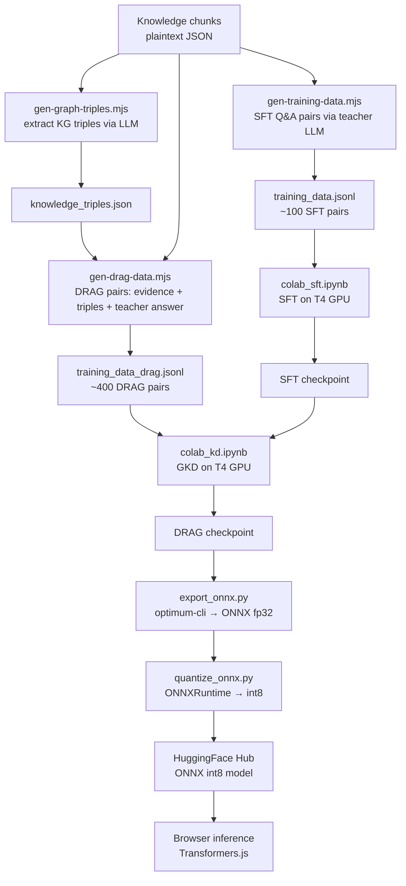

# SmolLM2-360M — SFT + DRAG Distillation Pipeline

> A reproducible pipeline for fine-tuning a 360M-parameter language model on
> structured knowledge using Supervised Fine-Tuning (SFT) followed by
> **DRAG Distillation** (Document-Retrieval-Augmented Generation).
>
> The resulting model runs entirely **in the browser** via
> [Transformers.js](https://huggingface.co/docs/transformers.js) — no server required.

---

## What is DRAG Distillation?

Standard SFT trains a model to mimic answer-only pairs (question → answer).
It doesn't teach the model *how* to read evidence — it just memorizes answers.

**DRAG** (Document-Retrieval-Augmented Generation) distillation fixes this by:

1. Providing the student with **retrieved evidence chunks + knowledge-graph triples** at training time
2. Having a **large teacher model** (LLaMA 3.3 70B via Groq) generate grounded answers *from that evidence*
3. Training the student to replicate the teacher's reasoning process, not just its outputs

The result is a model that generalizes: it can answer questions it hasn't seen before,
as long as it has the right evidence at inference time.

### SFT vs DRAG — key differences

| | SFT | DRAG |
|---|---|---|
| Training signal | Answer pairs only | Teacher reasoning over evidence |
| Input format | `user: Q\nassistant: A` | `system: [evidence+triples]\nuser: Q\nassistant: A` |
| Generalisation | Memorizes Q→A | Learns to read + reason |
| Hallucination risk | Medium (memorized facts can drift) | Low (grounded in retrieved context) |
| Data required | ~100 pairs | ~400 pairs (higher quality via teacher) |
| Inference format | Matches training format | Matches training format exactly ✓ |

---

## Pipeline Overview



---

## Repository Structure

```
├── scripts/
│   ├── gen-training-data.mjs   # Step 1a: generate SFT Q&A pairs (teacher LLM)
│   ├── gen-graph-triples.mjs   # Step 1b: extract KG triples from chunks
│   └── gen-drag-data.mjs       # Step 2: generate DRAG training pairs
├── colab_sft.ipynb             # Step 3: SFT in Google Colab (T4 GPU)
├── colab_kd.ipynb              # Step 4: GKD/DRAG in Google Colab (T4 GPU)
├── export_onnx.py              # Step 5: export checkpoint → ONNX fp32
├── quantize_onnx.py            # Step 6: quantize ONNX → int8
└── specs/
    └── training-data.schema.json  # JSON schema for training data format
```

---

## Step 1 — Prepare knowledge chunks

The data-gen scripts expect your knowledge as JSON files:

- `public/data/knowledge_chunks.json` — array of `{ id, content, ... }` objects
- `public/data/company_chunks.json` — `{ chunks: [...] }` object

These are **not committed** (they may contain private information). Provide your own.

---

## Step 2 — Generate training data

### 2a — SFT pairs

```bash
GROQ_API_KEY=your_key node scripts/gen-training-data.mjs
# Output: training_data.jsonl (~100 pairs)
```

### 2b — KG triples (required for DRAG)

```bash
GROQ_API_KEY=your_key node scripts/gen-graph-triples.mjs
# Output: knowledge_triples.json
```

### 2c — DRAG pairs

```bash
GROQ_API_KEY=your_key node scripts/gen-drag-data.mjs
# Output: training_data_drag.jsonl (~400 pairs)
```

Each output line matches the schema in `specs/training-data.schema.json`:

```json
{
  "messages": [
    { "role": "system", "content": "..evidence + triples.." },
    { "role": "user",   "content": "Question?" },
    { "role": "assistant", "content": "Grounded answer." }
  ],
  "meta": {
    "sourceChunkIds": ["chunk-001"],
    "groundingScore": 0.94,
    "generatedBy": "llama-3.3-70b-versatile"
  }
}
```

---

## Step 3 — SFT in Google Colab

1. Open [Google Colab](https://colab.research.google.com/) → Runtime → T4 GPU
2. Upload `colab_sft.ipynb`
3. Run cells in order — upload `training_data.jsonl` when prompted
4. Download `checkpoint.zip` after training (~2–4 hours)

---

## Step 4 — DRAG distillation in Google Colab

1. Upload `colab_kd.ipynb` to Colab (T4 GPU)
2. Upload:
   - `training_data_drag.jsonl`
   - The SFT `checkpoint.zip` from Step 3
3. Run cells in order
4. Download the DRAG `checkpoint.zip`

---

## Step 5 — Export to ONNX

```bash
pip install 'optimum[exporters]' onnx onnxruntime

python export_onnx.py --checkpoint ./checkpoint --output ./onnx-export
```

---

## Step 6 — Quantize to int8

```bash
python quantize_onnx.py --input ./onnx-export --output ./onnx-int8
```

---

## Step 7 — Push to HuggingFace Hub

```bash
huggingface-cli login
huggingface-cli upload <your-hf-username>/smollm2-drag ./onnx-int8
```

---

## Results

| Metric | Base SmolLM2-360M | After SFT | After DRAG |
|--------|------------------|-----------|------------|
| Grounding score (internal eval) | — | ~0.80 | ~0.92 |
| Hallucination rate (manual audit) | high | medium | low |
| Model size (ONNX int8) | 360MB | 360MB | 360MB |
| Inference target | Browser (Transformers.js) | Browser | Browser |

---

## Reproducing with your own data

1. Replace the JSON chunk files with your own knowledge base
2. Update the name/persona references in the gen scripts if needed
3. Run Steps 2–7 above
4. Update `VITE_GEN_MODEL_2` in your app's `.env.local` to point at your HF model

---

## License

Scripts: MIT  
Base model: [SmolLM2-360M-Instruct](https://huggingface.co/HuggingFaceTB/SmolLM2-360M-Instruct) — Apache 2.0
