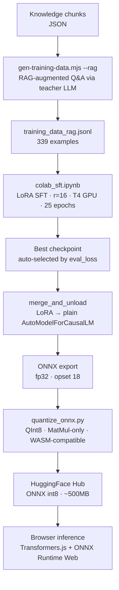

# SmolLM2-360M — DRAG Fine-Tuning Pipeline

> A reproducible pipeline for fine-tuning a 360M-parameter language model to answer
> questions grounded in retrieved evidence — running entirely **in the browser** via
> [Transformers.js](https://huggingface.co/docs/transformers.js). No server required.

This repo documents three iterations of training, each addressing a failure discovered
in the previous run. The engineering decisions and diagnostics are the point.

---

## What is DRAG?

**DRAG** (Distilled Retrieval-Augmented Generation) trains a small model to answer
questions grounded in retrieved evidence — not from memorized facts.

At inference time, the top retrieved chunk is injected into the system prompt. The
model is trained to read that evidence and answer from it, not to hallucinate from
pretraining knowledge.

---

## Iteration History

### v1 — Full SFT, bare Q&A pairs (`colab_kd.ipynb`)

**Training data:** ~100 simple `user → assistant` pairs, no system message, no evidence.  
**Result:** Model hallucinated confidently. Invented fake employers and job titles.  
**Root cause:** At inference the model receives `system: [evidence chunk]` — a format
it never saw during training. It ignored the evidence entirely.

---

### v2 — Full SFT, RAG-augmented format

**Training data:** 339 examples regenerated with the exact `system+evidence+user+assistant`
format that matches inference. Evidence truncated to 400 chars — same as inference.  
**Result:** RAG-grounded responses improved significantly. But off-topic questions
(e.g. "leadership skills") produced confident hallucinations with invented names.  
**Root cause:** Two problems from full fine-tuning on a small dataset:

1. **Catastrophic forgetting of DPO behavior.** SmolLM2-360M-Instruct was post-trained
   with Direct Preference Optimization (DPO) to prefer cautious, grounded answers.
   Full SFT on 339 examples overwrote those weights. The model unlearned "I don't know."
2. **Context window regression.** Training at `max_length=768` degraded attention
   patterns beyond that range. The base model supports 8192 tokens; this run broke that.

Best val loss: **0.604** at epoch 9 (16 epochs, `load_best_model_at_end=True`).

---

### v3 — LoRA SFT, RAG-augmented format (`colab_sft.ipynb`) ← current

**Key insight:** We don't need to change *how the model behaves* — only *what it knows*.
LoRA freezes 99% of the model's weights (including DPO-tuned layers) and trains only
~3.5M low-rank adapter parameters.

**Changes from v2:**
- `peft` LoRA: `r=16`, `alpha=32`, all attention + MLP projections targeted
- `max_length=2048` — safe on T4; preserves base model's attention range
- `learning_rate=1e-4` — LoRA adapters start from zero and need a higher rate
- `merge_and_unload()` before saving — collapses adapters into base weights for ONNX export

**Result:** DPO refusal behavior preserved. Bare prompts produce generic but
non-fabricated responses. RAG-grounded responses stay anchored to the evidence.

```
Epoch  Training Loss  Validation Loss
9      1.516954       1.491365
15     0.597164       0.741425
20     0.487317       0.697417
23     0.486048       0.693020  ← best (load_best_model_at_end)
24     0.475421       0.693383
25     0.471588       0.693433
```

Best val loss: **0.693** at epoch 23 (25 epochs).

> The higher floor vs v2 (0.693 vs 0.604) is expected — LoRA has less expressivity
> than full fine-tuning. The tradeoff is intentional: better behavior over lower loss.

---

## Training Data Format

Each example uses the exact same format as inference:

```json
{
  "messages": [
    {
      "role": "system",
      "content": "You are a helpful assistant for Kham's portfolio. Be concise and accurate.\nAnswer using ONLY these facts:\n1. {evidence chunk, ≤400 chars}"
    },
    { "role": "user",      "content": "Question?" },
    { "role": "assistant", "content": "Grounded answer." }
  ],
  "meta": {
    "sourceChunkIds": ["chunk-001"],
    "groundingScore": 0.94,
    "ragMode": true
  }
}
```

The system prompt wording and evidence format match inference exactly — this
train/inference alignment is what makes RAG grounding work.

---

## Pipeline Overview



---

## Repository Structure

```
├── scripts/
│   ├── gen-training-data.mjs   # Generate RAG-augmented training data (--rag flag)
│   ├── gen-graph-triples.mjs   # Extract KG triples from chunks (v1 pipeline)
│   └── gen-drag-data.mjs       # Generate teacher-distilled DRAG pairs (v1 pipeline)
├── colab_sft.ipynb             # v3: LoRA SFT — current recommended notebook
├── colab_kd.ipynb              # v1: Full SFT with teacher distillation (reference)
├── export_onnx.py              # Export checkpoint → ONNX fp32
├── quantize_onnx.py            # Quantize ONNX → QInt8 (MatMul-only for WASM compat)
└── specs/
    └── training-data.schema.json  # JSON schema for training data format
```

---

## Quickstart (v3 LoRA pipeline)

### Step 1 — Prepare knowledge chunks

Provide your knowledge as JSON files:

- `public/data/knowledge_chunks.json` — array of `{ id, content, ... }` objects
- `public/data/company_chunks.json` — `{ chunks: [...] }` object

These are **not committed** (may contain private information).

### Step 2 — Generate RAG-augmented training data

```bash
GROQ_API_KEY=your_key node scripts/gen-training-data.mjs --rag
# Output: training_data_rag.jsonl (~300-400 examples)
```

The `--rag` flag generates `system+evidence+user+assistant` format.
Evidence is truncated to 400 chars per example — must match your inference prompt.

### Step 3 — Fine-tune with LoRA in Google Colab

1. Open [Google Colab](https://colab.research.google.com/) → Runtime → T4 GPU
2. Upload `colab_sft.ipynb`
3. Upload `training_data_rag.jsonl` to Google Drive at your configured path
4. Run cells in order

**Key LoRA parameters:**

| Parameter | Value | Why |
|-----------|-------|-----|
| `r` | 16 | Rank — controls adapter expressivity |
| `lora_alpha` | 32 | Scale factor (alpha/r = 2 is standard) |
| `target_modules` | q/k/v/o + gate/up/down proj | All linear layers in Llama attention + MLP |
| `learning_rate` | 1e-4 | Higher than full SFT — adapters start from zero |
| `max_length` | 2048 | Preserves base model's attention range |
| `num_train_epochs` | 25 | `load_best_model_at_end` handles early stopping |
| `trainable params` | ~3.5M / 360M (~1%) | Only adapters update; base weights frozen |

### Step 4 — Export and quantize

```bash
# Export (Python API — more reliable than CLI)
from optimum.exporters.onnx import main_export
main_export(model_name_or_path="./checkpoint", output="./onnx-export",
            task="text-generation-with-past", opset=18, dtype="fp32")

# Quantize (MatMul-only — required for ONNX Runtime Web WASM compatibility)
python quantize_onnx.py
```

> **WASM compatibility note:** `quantize_dynamic` without `op_types_to_quantize=['MatMul']`
> produces float16 DequantizeLinear outputs that crash ONNX Runtime Web with
> `Type (tensor(float16)) does not match expected type (tensor(float))`.
> Always restrict quantization to MatMul ops only.

### Step 5 — Push to HuggingFace Hub

```python
from huggingface_hub import HfApi
api = HfApi()
api.upload_folder(folder_path="./onnx-export", repo_id="<your-hf-username>/smollm2-drag",
                  repo_type="model")
```

---

## Results Summary

| Run | Method | Training data | Best val loss | Hallucination |
|-----|--------|--------------|---------------|---------------|
| v1 | Full SFT | Bare Q&A (~100) | ~1.58 | High (fake employers) |
| v2 | Full SFT | RAG-format (~339) | 0.604 | Medium (DPO overwritten) |
| **v3** | **LoRA SFT** | **RAG-format (~339)** | **0.693** | **Low (DPO preserved)** |

The higher loss in v3 vs v2 is intentional — LoRA has less expressivity but preserves
the base model's instruction-following and refusal behavior from DPO post-training.

---

## Reproducing with your own data

1. Replace the JSON chunk files with your own knowledge base
2. Update the persona references in the gen script prompts
3. Run Steps 2–5 above
4. Set `VITE_GEN_MODEL_2=<your-hf-username>/smollm2-drag` in your app's `.env.local`

---

## License

Scripts: MIT  
Base model: [SmolLM2-360M-Instruct](https://huggingface.co/HuggingFaceTB/SmolLM2-360M-Instruct) — Apache 2.0
